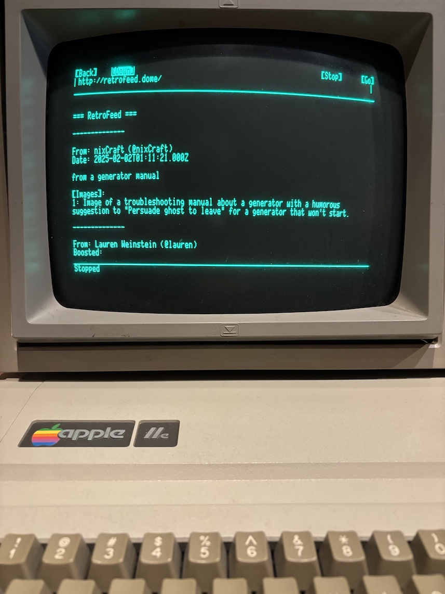

# RetroFeed

RetroFeed is a Mastodon feed reader designed for vintage computers. It transforms your Mastodon timeline into a format compatible with text-based browsers like Contiki's web browser for 8-bit computers. Written and tested for my Apple IIe. Inspired by http://www.frogfind.com 



## Features

- Simple text-based interface compatible with minimal browsers
- Mastodon timeline integration
- Configurable for any Mastodon instance
- Local network deployment for vintage computer access
- Line breaks and text formatting preserved

## Prerequisites

- RHEL 8/9 or compatible system
- Java 11 or higher
- Apache Tomcat
- Apache HTTP Server
- A Mastodon account

## Installation

### 1. System Setup

Install required packages:
```bash
sudo dnf update
sudo dnf install java-11-openjdk-devel maven git httpd

# Install Tomcat packages
sudo dnf install tomcat tomcat-webapps tomcat-admin-webapps tomcat-lib
```

### 2. Java Configuration

Ensure Java 11 is set as default:
```bash
sudo alternatives --config java    # Select Java 11
sudo alternatives --config javac   # Select Java 11
```

Set JAVA_HOME for Maven:
```bash
export JAVA_HOME=/usr/lib/jvm/java-11-openjdk-11.0.25.0.9-2.el8.x86_64 #Use your specific version
echo $JAVA_HOME
mvn -version    # Verify Maven is using Java 11
```

Consider adding the JAVA_HOME export to your ~/.bashrc file for persistence.

### 3. Project Setup

Create project directories:
```bash
sudo mkdir -p /opt/retrofeed/{source,current,backups}
sudo chown -R $USER:$USER /opt/retrofeed
```

Clone the repository:
```bash
cd /opt/retrofeed/source
git clone https://github.com/busrus/retrofeed.git
```

### 4. Mastodon API Token

1. Log into your Mastodon instance
2. Go to Preferences -> Development
3. Click "New Application"
4. Fill in the details:
   - Application name: RetroFeed
   - Application website: (optional)
   - Redirect URI: Leave as default (urn:ietf:wg:oauth:2.0:oob)
   - Scopes: Select "read"
5. Submit and copy the generated access token

### 5. Configuration

Create configuration directory and file:
```bash
sudo mkdir -p /etc/retrofeed
sudo vi /etc/retrofeed/config.properties
```

Add the following content:
```properties
mastodon.instance=https://your.mastodon.instance
mastodon.token=your_access_token
```

Set proper permissions:
```bash
sudo chmod 640 /etc/retrofeed/config.properties
sudo chown tomcat:tomcat /etc/retrofeed/config.properties
```

### 6. Apache Configuration

Create Apache configuration file:
```bash
sudo vi /etc/httpd/conf.d/retrofeed.conf
```

Add the following content:
```apache
# Enable required modules
LoadModule proxy_module modules/mod_proxy.so
LoadModule proxy_http_module modules/mod_proxy_http.so
LoadModule rewrite_module modules/mod_rewrite.so

# Proxy configuration for RetroFeed
<VirtualHost *:80>
    ServerAdmin webmaster@localhost
    DocumentRoot /var/www/html

    # Proxy settings
    ProxyPreserveHost On
    ProxyRequests Off

    # Rewrite rules - using [P] for internal proxy
    RewriteEngine On
    RewriteRule ^/?$ /retrofeed/feed [P,L]

    # Proxy rules
    ProxyPass /retrofeed http://localhost:8080/retrofeed
    ProxyPassReverse /retrofeed http://localhost:8080/retrofeed

    # Basic logging configuration
    ErrorLog logs/retrofeed_error.log
    CustomLog logs/retrofeed_access.log combined

    # Handle vintage browsers
    BrowserMatch "^Contiki" force-response-1.0

    # Ensure UTF-8 is preserved
    AddDefaultCharset UTF-8
</VirtualHost>
```

### 7. Firewall Configuration

Configure firewall to allow HTTP and Tomcat access:
```bash
sudo firewall-cmd --zone=public --add-service=http --permanent
sudo firewall-cmd --zone=public --add-service=https --permanent
sudo firewall-cmd --zone=public --add-port=8080/tcp --permanent
sudo firewall-cmd --reload
```

### 8. SELinux Configuration

Allow Apache to proxy to Tomcat:
```bash
sudo setsebool -P httpd_can_network_connect 1
```

### 9. Build and Deploy

Build the application:
```bash
cd /opt/retrofeed/source
mvn clean package
```

Deploy to Tomcat:
```bash
sudo cp target/retrofeed.war /var/lib/tomcat/webapps/retrofeed.war
```

### 10. Start Services

```bash
sudo systemctl enable --now httpd
sudo systemctl enable --now tomcat
```

## Usage

Access RetroFeed from your vintage computer by navigating to:
```
http://your.server.ip/
```

The feed will be displayed in a format compatible with text-based browsers.

## Troubleshooting

1. Check Tomcat logs:
```bash
sudo tail -f /var/lib/tomcat/logs/catalina.out
```

2. Check Apache logs:
```bash
sudo tail -f /var/log/httpd/error_log
```

3. Verify services are running:
```bash
sudo systemctl status httpd
sudo systemctl status tomcat
```

## License

This project is licensed under the MIT License - see the LICENSE file for details.

## Contributing

Pull requests are welcome. For major changes, please open an issue first to discuss what you would like to change.
